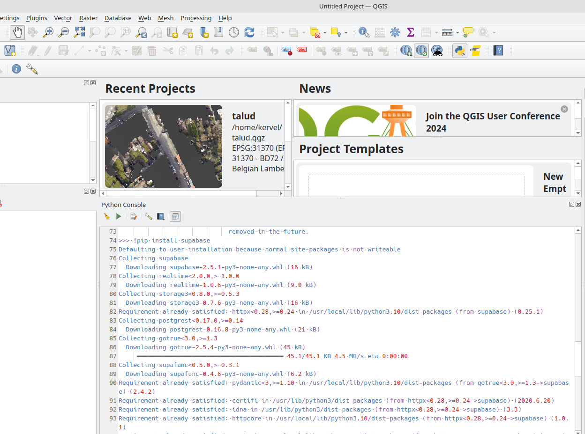

# QGIS-Plugin
This plugin allows uploading QGIS shapefiles/layers to a server for integration with the "schakelboekje" application.

Before an upload to the server can be performed, certain checks should and will be performed. There are 3 checks: 

* check whether the ID is unique (for both layers), 
* check whether the ID is not null (for both layers) and 
* check whether there is a switch between every feeder section.

When the check buttons is pressed, all 3 checks will be performed at once. 

If the checks fail, error layers will be created, which will contain the errors that should be fixed before proceeding.

Upon passing checks, an upload can be performed, first to the landing table. This will result in an overview of the changes that have been made. Afterwards, users will have the choice to cancel or to accept the changes. When the user accepts the changes, an upload will happen to the final table, which is connected with the "schakelboekje" application. 

When making an upload to the final table, a copy of the shapefiles will also be uploaded to a bucket on the server. The goal is that the plugin also contains a button "Get shapfiles", which will download the shapefiles from the server, so the user can always work with the most recent version of the shapefiles. However, this functionality is still under development.  

## How to use locally
### Installing the plugin

This plugin requires supabase, so you need to install it like so:

* open a python console in qgis
* type `!pip install supabase` (the exclamation mark designates this code as a shell command)

The plugin is a zipped verison of the [server_uploader](server_uploader) folder.
Download it [here](https://github.com/bramwuytss/QGIS-Plugin/raw/main/server_uploader.zip) and don't unzip it. Next, open QGIS and navigate to `Plugins -> Manage and install Plugins -> Install from ZIP`. 

Locate the downloaded zip folder and click "Install Plugin".
The plugin will now be installed in QGIS. Upon installation, an extracted folder will be created at the installation path of QGIS. For example for windows: C:\Users\UserName\AppData\Roaming\QGIS\QGIS3\profiles\default\python\plugins  

We can now use the plugin, using the sample data provided below.  
If you need to modify the plugin's functionality, navigate to the extracted folder and edit either the "Server_uploader.py" or "Server_uploader_dialog.py" files.   
To view the changes made to the plugin, we need to reload the plugin. To do this, another plugin called "Plugin reloader" can be used.  

### Sample data
Download the [sample data QGIS.zip]((https://github.com/bramwuytss/QGIS-Plugin/raw/main/Sample%20Data%20QGIS.zip) folder.  
Extract the downloaded ZIP-file to a location on your computer.    
Locate and open the QGIS project file named `Sample Data` from the extracted folder.   
QGIS will launch and load 2 layers from the project file.  
These 2 layers are ready to be used for performing checks and preparing uploads to the server using the plugin.  

